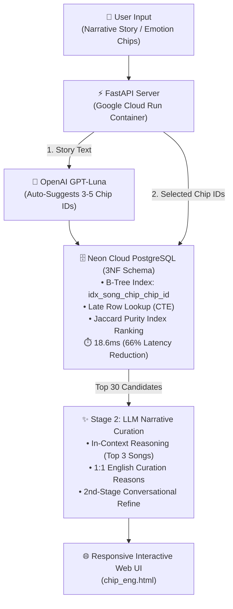

# 🌌 96-Chip Narrative Music Recommender (Lyrics-Driven)

An end-to-end, full-stack AI music recommendation system that curates tracks from a **23,000+ song database** based on fine-grained **lyrical narrative arcs and psychological emotions**, rather than superficial audio/genre metadata. 

Awarded research grant funding by the **Undergraduate Research Scholars Program (URSP)** at George Mason University.

---

## Key Architectural Highlights

- **23,000+ Song Corpus**: Built an end-to-end ETL pipeline that collected tracks from curated Spotify playlists and scraped full lyrics from Genius, transforming raw unstructured text into structured narrative summaries and multi-theme mappings for 23,000+ songs.
- **96-Chip Emotion Taxonomy**: Hierarchical 2-tier ontology ($12\text{ Macro Domains} \times 8\text{ Sub-Nuance Micro Chips}$) constructed via LLM-enhanced semantic clustering, inspired by the topic modeling methodology proposed in QualIT [[Kapoor et al., 2024]](https://arxiv.org/abs/2410.00290).
- **Sub-20ms Candidate Retrieval**: Achieved a **66% query latency reduction** (54.3ms $\rightarrow$ 18.6ms) on Cloud PostgreSQL using **Late Row Lookup (CTE)** and **B-Tree indexing**.
- **Jaccard Purity Index Ranking**: Solved multi-tag dilution by prioritizing emotional concentration over raw keyword counts.
- **2-Stage Hybrid Serving**: Combined ultra-fast indexed SQL candidate filtering (Stage 1) with real-time in-context LLM reasoning and 2nd-stage conversational refinement (Stage 2).

---

## System Architecture & Data Pipeline

## References
- Kapoor, S., Gil, A., Bhaduri, S., Mittal, A., & Mulkar, R. (2024). *Qualitative Insights Tool (QualIT): LLM Enhanced Topic Modeling*. arXiv preprint. [https://arxiv.org/abs/2410.00290](https://arxiv.org/abs/2410.00290)
